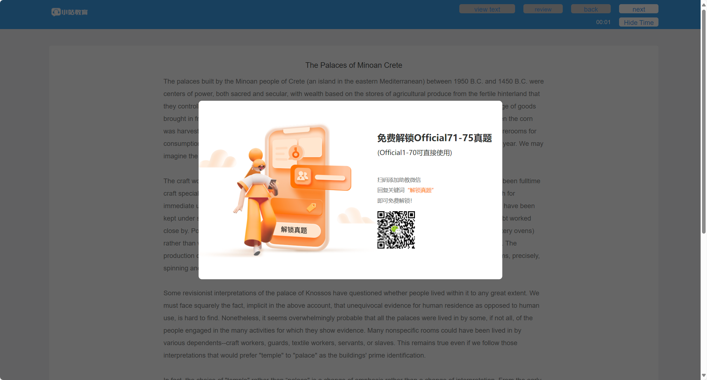
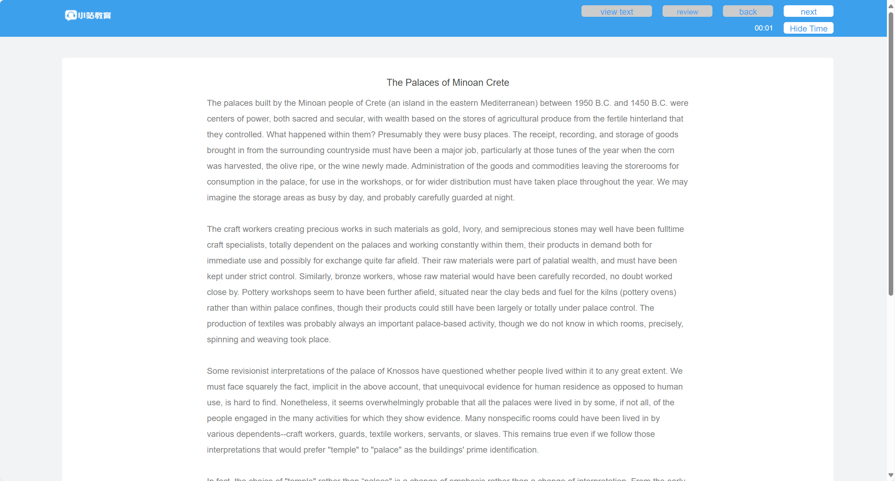

# 移除小站阅读弹窗插件（Zhan.com Ad Remover Extension)

[](https://opensource.org/licenses/MIT)

这是一个简单的浏览器扩展程序，用于移除**小站教育（zhan.com）**托福 TPO 阅读练习页面上偶尔出现的“扫码解锁”或类似推广弹窗，帮助用户获得更流畅、专注的学习体验。

## ✨ 功能特性

* **自动移除弹窗：**自动检测并移除 `top.zhan.com` 阅读练习（`practice.html`）和文章开始（`start.html`）页面上的特定遮罩弹窗（`<div class="model_mask">...</div>`)。
* **轻量高效：**代码简洁，只针对特定元素操作，对浏览器性能影响极小。
* **专注核心：**只做移除弹窗这一件事，无任何额外功能或数据收集。
* **易于安装：**可通过浏览器的开发者模式轻松加载本地源代码进行安装。
* **跨浏览器兼容：**主要为 Edge 设计，但也兼容 Chrome 及其他基于 Chromium 内核的浏览器。

## 🎯 目标页面

本扩展主要作用于以下格式的小站 TPO 阅读相关页面：

* `https://top.zhan.com/toefl/read/practice.html?...`
* `https://top.zhan.com/toefl/read/start.html?...`

当这些页面加载时，如果存在目标弹窗元素，扩展会尝试将其移除。

## 🚀 安装指南

由于此扩展未在官方应用商店上架，你需要通过“开发者模式”从源代码加载它：

1.   **获取代码：**
    * **方式一（推荐)：**使用 Git 克隆本仓库到你的本地电脑：
        
        ```bash
        git clone https://github.com/Planetes1mal/topzhan-ad-remover-extension.git
        ```
    * **方式二：**在本仓库主页点击 `Code` -> `Download ZIP` 下载压缩包，然后解压到你电脑的某个位置。

2.   **打开浏览器扩展管理页面：**
    * **Edge：**在地址栏输入 `edge://extensions/` 并回车。
    * **Chrome：**在地址栏输入 `chrome://extensions/` 并回车。

3.   **启用开发者模式：**在扩展管理页面的右上角（或左下角，取决于浏览器版本），找到并打开 **“开发人员模式”**（Developer mode）的开关。
    
4.   **加载扩展：**
    
    * 点击页面上出现的 **“加载解压缩的扩展”**（Load unpacked）按钮。
    * 在弹出的文件选择窗口中，**选择你刚刚克隆或解压的项目文件夹**（确保是包含 `manifest.json` 文件的那个文件夹，而不是里面的子文件或父文件夹)。
    
5.  **安装完成：**如果一切顺利，“移除小站阅读弹窗插件”会出现在你的扩展列表中，并处于启用状态。扩展图标会显示在浏览器工具栏上。

## 💡 使用方法

安装并启用扩展后，无需进行任何额外操作。

当你访问上述目标小站页面时，扩展会在后台自动运行。如果页面加载了需要移除的弹窗，扩展会将其从页面上删除，让你能够直接访问页面内容。

## 🖼️截图

移除弹窗效果对比：

|                            移除前                            |                            移除后                            |
| :----------------------------------------------------------: | :----------------------------------------------------------: |
|  |  |

## 🤝 贡献

欢迎通过以下方式为本项目做出贡献：

* **报告 Bug：**如果你发现弹窗没有被移除，或者扩展导致了页面其他问题，请在 [GitHub Issues](https://github.com/Planetes1mal/topzhan-ad-remover-extension/issues) 中提交详细报告（请替换为你的 Issues 链接）。
* **提出建议：**如果你有改进功能的想法，也欢迎在 Issues 中提出。
* **提交代码：**如果你修复了 Bug 或实现了新功能，可以通过 Pull Request 提交你的代码。

## 📜 许可协议

本项目采用 [MIT 许可证](LICENSE) 开源。简而言之，你可以自由地使用、复制、修改、合并、发布、分发、再许可和/或销售本软件的副本，只需在所有副本或重要部分中包含原始的版权声明和许可声明。

## 🙏 致谢与说明

* 本扩展的图标由 **ChatGPT（DALL-E）**生成。
* **请注意：**小站教育（zhan.com）网站的结构或样式可能会发生变化。如果未来该网站更新导致目标弹窗的 HTML 结构或 CSS 类名（`model_mask`）改变，本扩展可能会失效，届时需要更新扩展代码。